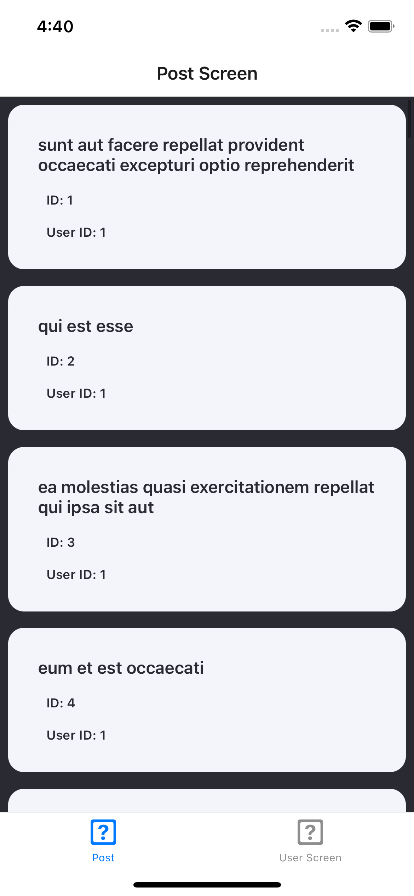
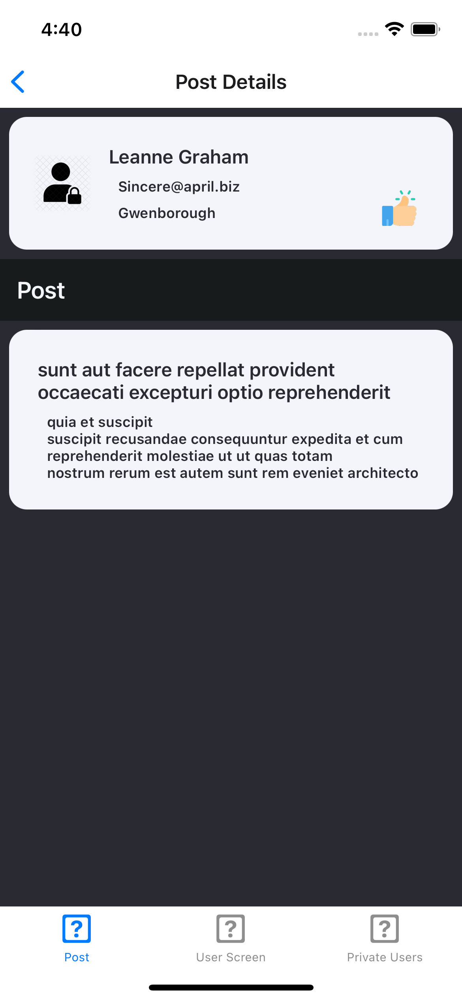
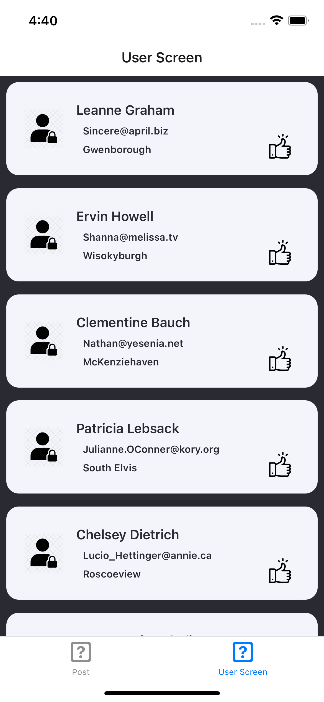
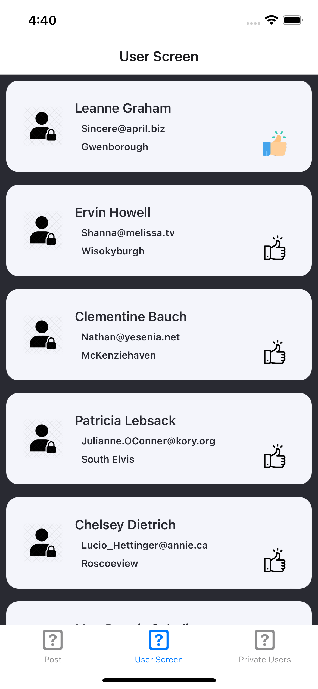
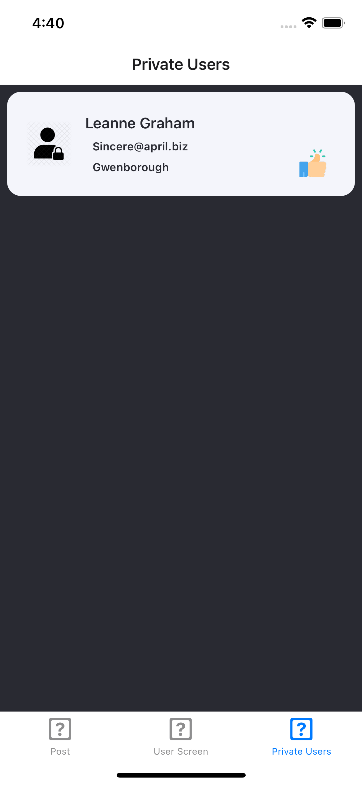

# RN-Post-Users
This is a React Native project that focuses on listing Posts / Users / Adding the Users to the Private list.

## Description
* App is a React Native app that lists of posts and users.
* The app uses the [jsonplaceholder](https://jsonplaceholder.typicode.com/) API to fetch the data.
* The user can be marked as a private user by clicking on the Like button.
* App is made by using React Hooks & Functional Components.

## Download App
* [App Link](https://github.com/AbhasVohra/RN-Post-Users/actions)

## Related Links
* [Redux](https://redux.js.org/introduction/getting-started)
* [React-Navigation](https://reactnavigation.org/)
* [React-Native-Hooks](https://react-hooks.org/)
* [Github Actions](https://docs.github.com/en/actions)

## Screent Shots
<pre align="center" width="100%">   </pre>
<pre align="center" width="100%">      </pre>

## Connect Me
* [Twitter](https://twitter.com/Abhas_Vohra)
* [Medium](https://medium.com/@developer.abhas)
